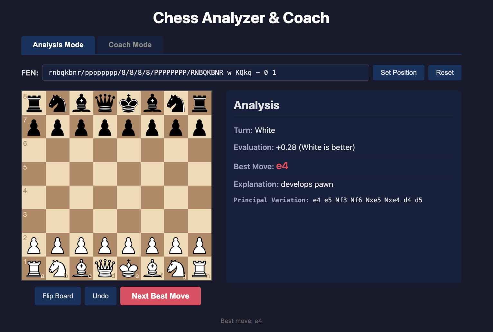
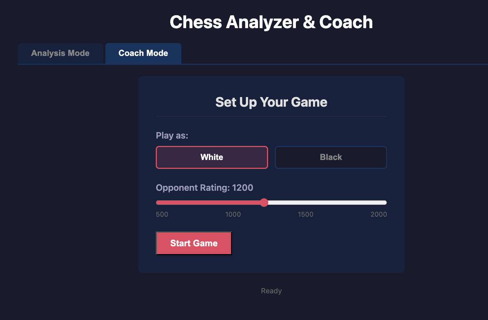
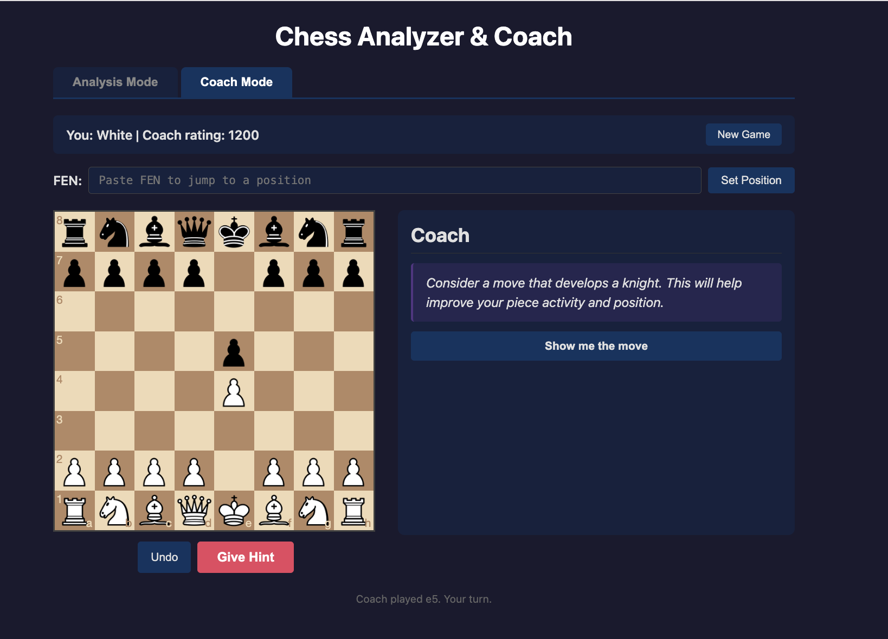
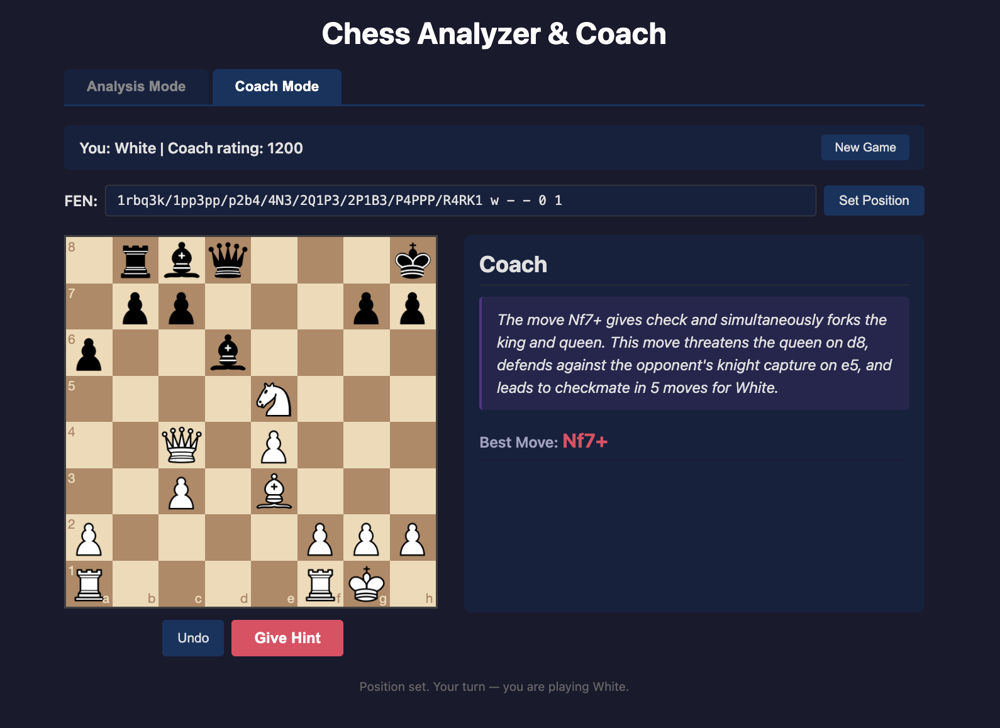

# Chess Analyzer & Coach

A web app that combines Stockfish engine analysis with an AI coaching layer to help players understand and improve their chess.

## Features

**Analysis Mode**
- Drag pieces to set up any position, or paste a FEN
- Get Stockfish's best move with a plain-English explanation of *why* it works
- Detects tactics: forks, pins, discovered attacks, double checks, threats created, opponent threats neutralized, and more
- Shows the principal variation and mate sequences



**Coach Mode**
- Play against Stockfish at an adjustable rating (500–2000)
- Ask for a vague hint or "show me the move" with a full explanation
- Hints are generated by Claude (via AWS Bedrock) and grounded strictly in the engine's analysis



| Vague hint | Full explanation |
|---|---|
|  |  |

## Setup

### 1. Clone the repository

```bash
git clone https://github.com/kannanjain/chess-analyzer-coach.git
cd chess-analyzer-coach
```

### 2. Create a virtual environment and install dependencies

```bash
python3 -m venv .venv
source .venv/bin/activate
pip install -r requirements.txt
```

### 3. Install Stockfish

Download and install Stockfish from [stockfishchess.org](https://stockfishchess.org/download/). If the binary isn't on your PATH, set the `STOCKFISH_PATH` environment variable to point at it.

### 4. Configure AWS credentials

Copy the example env file and fill in your credentials:

```bash
cp .env.example .env
```

The hint feature uses Claude via AWS Bedrock. You'll need an AWS account with Bedrock model access enabled. See the [AWS Bedrock documentation](https://docs.aws.amazon.com/bedrock/latest/userguide/getting-started.html) to get set up and obtain credentials.

### 5. Run the app

```bash
python app.py
```

Then open [http://localhost:5001](http://localhost:5001) in your browser.

---

## Architecture

```
┌─────────────────────────────────────────────────────────────┐
│                         Browser                             │
│        chessboard.js  ·  chess.js  ·  vanilla JS           │
└──────────────────────────┬──────────────────────────────────┘
                           │  HTTP / JSON
                           ▼
┌─────────────────────────────────────────────────────────────┐
│                  Flask server  (app.py)                     │
│                                                             │
│  POST /api/analyze    POST /api/coach/move   POST /api/hint │
└────────┬─────────────────────┬────────────────────┬─────────┘
         │                     │                    │
         ▼                     ▼                    ▼
┌─────────────────┐  ┌──────────────────┐  ┌───────────────────────┐
│position_analyzer│  │    Stockfish     │  │  position_analyzer.py │
│      .py        │  │  engine.play     │  │  (tactic engine)      │
│  (Stockfish     │  │  UCI_Elo 500–    │  │                       │
│   depth 1–24)   │  │  2000            │  └──────────┬────────────┘
└─────────────────┘  └──────────────────┘             │ structured facts
                                                       ▼
                                           ┌──────────────────────┐
                                           │    AWS Bedrock       │
                                           │    Claude            │
                                           └──────────────────────┘
```

---

## Stack

- **Backend:** Python, Flask, python-chess
- **Engine:** Stockfish
- **Tactic analysis:** custom Python engine in `position_analyzer.py`
- **AI coaching:** Claude via AWS Bedrock
- **Frontend:** chessboard.js, chess.js, vanilla JS
